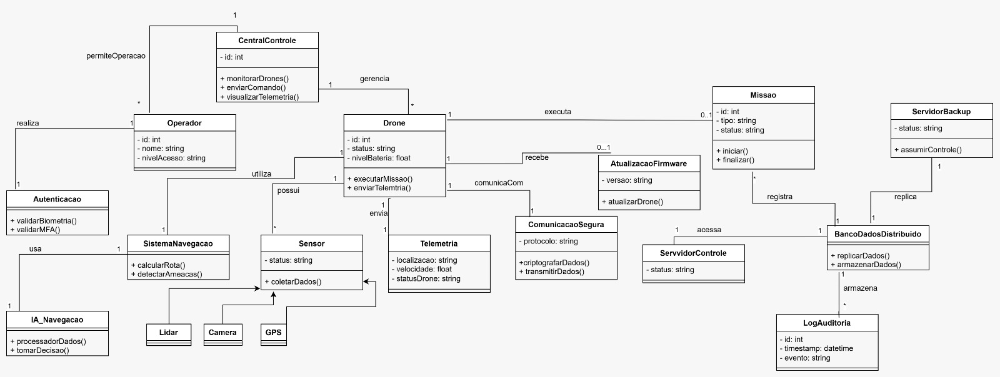

# Etapa 2 – Diagrama de Classes Inicial: Sistema Falcão Sombrio

Nesta etapa, foi elaborado o **diagrama de classes UML** representando a arquitetura de controle, segurança e operação do **Sistema Falcão Sombrio**.

---

## 📌 Diagrama de Classes

---
